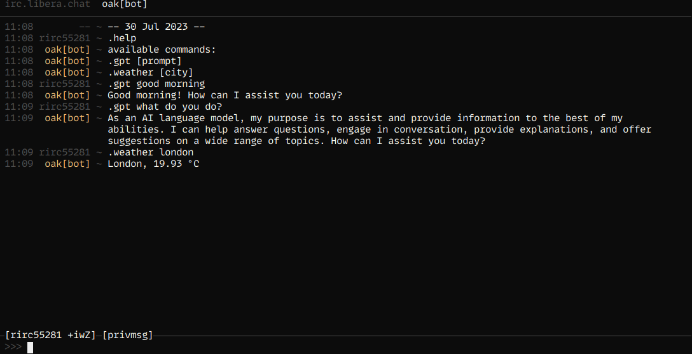

# oak
Modular IRC bot written in Ruby
## Installation
The gem is not available yet in any gem hosting service, so build and install from source
```
gem build oak.gemspec
gem install oak-1.0.0.gem
```

## Requirements
- Ruby 2.6.0 or higher
- IIRC 0.6.3
- Thor 1.2
## Usage
Create a config file such as:
```
---
networks:
  -
    host: irc.libera.chat
    port: 6697
    nick: botnick
    channels: ["#chan1", "#chan2"]
...
```
then launch the bot
```
oak go config.yml
```

## Development
To add a module create a file like `lib/oak/greet.rb`
```
module Oak
  module Greet
    def configure_greet
      on :join, :do_greet
    end

    def do_greet evt
      say "Hi there"
    end
  end
end
```

then include greet in `lib/oak/oak.rb`